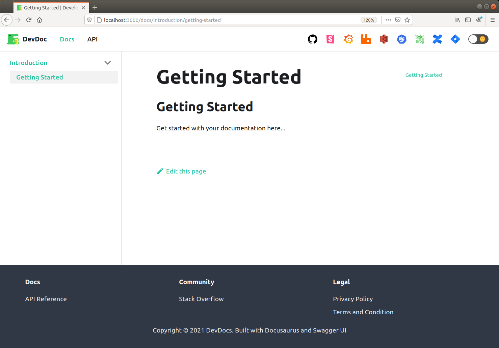
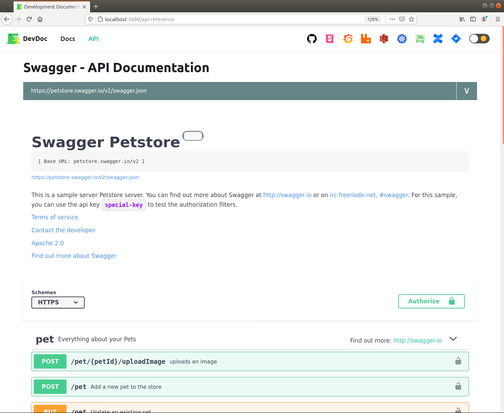

# Docusaurus + Swagger Boilerplate

Boilerplate for a static website built using [Docusaurus v2](https://docusaurus.io/) and [Swagger](https://www.npmjs.com/package/swagger-ui-react) 
for documenting software applications. The website can be easily populated with content using markdown for text documentation as well as
API Documentation using swagger-ui-react which loads swagger.json from API endpoints.

- [Screenshot](#screenshot)
- [Usage](#usage)
    - [Configuration](#configuration)
    - [Start the web](#running-the-web)
    - [Build, publish and deploy](#build-publish-and-deploy)
- [Reference](#reference)

## Screenshot

### Documentation with mdx



### API Documentation with swagger



## Usage

### Configuration

Refer to the following files to make configuration for the website.
- [web-config.json](web-config.json)
- [docusaurus.config.js](docusaurus.config.js)

### Running the web

1. Install packages
    ```bash
    yarn install
    ```

2. Start the web
    ```bash
    yarn start
    Browse to http://localhost:3000
   
    # To test functionality of search (only available in production build)
    yarn build
    npx http-server ./build
    Browse to http://localhost:8080
    ```
   
### Build, publish and deploy

- On Github pages - Google yourself
- As a container
    - Building Stage  
        ```bash 
        # Build Docker Image
        docker build --build-arg BUILD_ENV=development -t docusaurus_swagger:<VERSION_TAG> .
        
        # Remove intermediate build files
        docker image prune --filter label=stage=builder
      
        # Start an instance
        docker run -p 8080:80 --name devdocs -d docusaurus_swagger:<VERSION_TAG>
      
        # Browse the website (http)
        http://localhost:8080
      
        # Clean up
        docker rm -f devdocs
        docker rmi docusaurus_swagger
        ```
    - Publishing Stage
        - Using Docker Commands
            ```bash
            docker login 
            docker push devdocs
            ```
        - Using Kaniko
            - Encode your Artifactory username:passwor dusing a base64 encoder
                - `echo -n "artifactory_user:artifactory_pass" | base64 -w 0`
            - Replace **user:password** inside **deploy/config.json** with the base64 encoded value
            - Replace **DOCKER_REG_URL** with `docker.artifact.eden.dot`
            - Run the command (example below)  
                ```bash
                docker run \
                    -v /path/to/project:/workspace \
                    -v /path/to/project/deploy/config.json:/kaniko/.docker/config.json:ro \
                    -v /path/to/ca.some.crt:/kaniko/ssl/certs/ca.some.crt \
                    gcr.io/kaniko-project/executor:debug
                    --dockerfile /workspace/Dockerfile
                    --build-arg BUILD_ENV=development
                    --context /workspace
                    --destination devdocs:<VERSION_TAG>
                ```
     - Deploying to kubernetes
        - `kubectl apply -f deploy/deploy_to_k8.yaml` 
       
## Reference

- Webpack Issues
    - [Error when using swagger-ui-react: Buffer is not defined](https://github.com/swagger-api/swagger-ui/issues/6869)
    - [Custom webpack plugins](https://github.com/facebook/docusaurus/issues/2097)
    - [Webpack 5 Issues - Buffer removed, it cause some trouble](https://github.com/webpack/changelog-v5/issues/10#issuecomment-615877593)
    - [How to polyfill node core modules in webpack 5](https://sanchit3b.medium.com/how-to-polyfill-node-core-modules-in-webpack-5-905c1f5504a0)
- Deploying using Docker and Nginx
    - [Deploy docusaurus with docker and nginx](https://ledinhcuong99.medium.com/deploy-docusaurus-with-docker-and-nginx-8c78b1390db6)
    - [How to remove intermediate images from a build after a build](https://stackoverflow.com/questions/50126741/how-to-remove-intermediate-images-from-a-build-after-the-build)
    